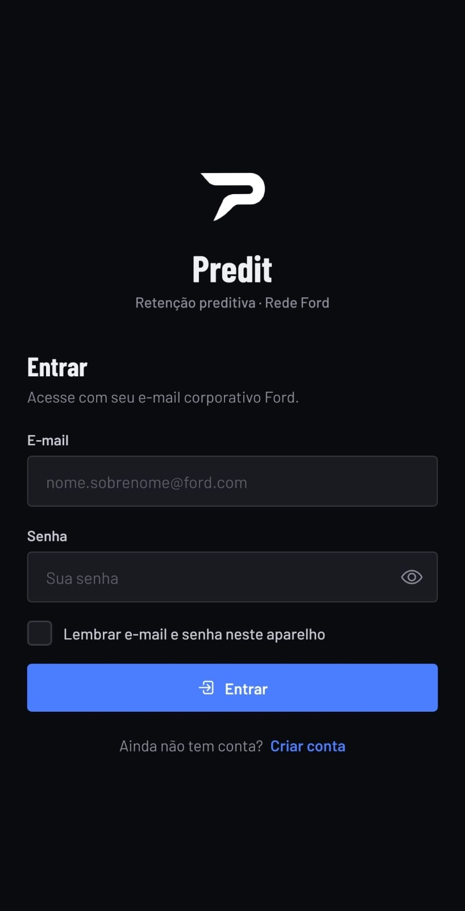
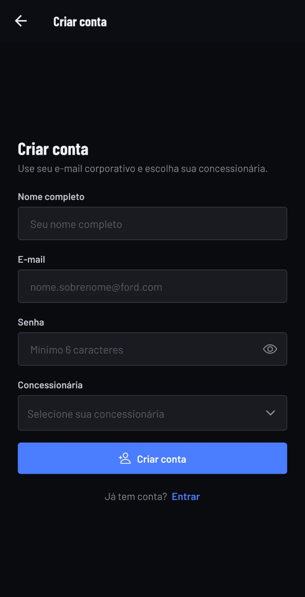
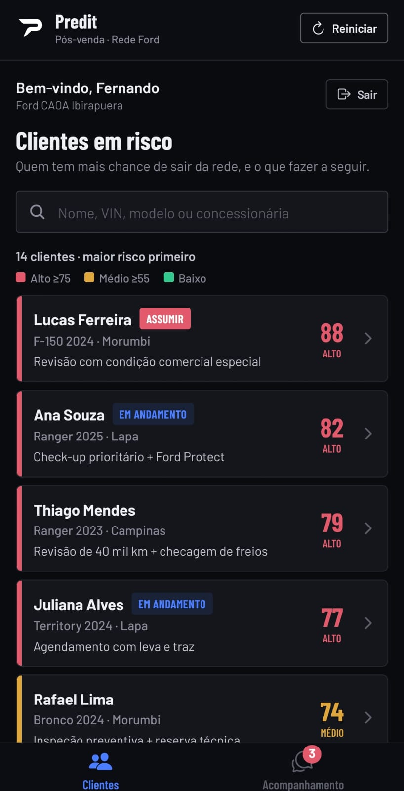
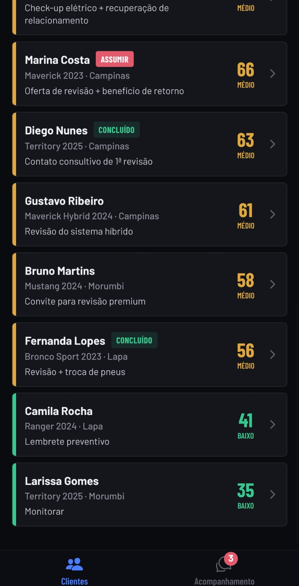
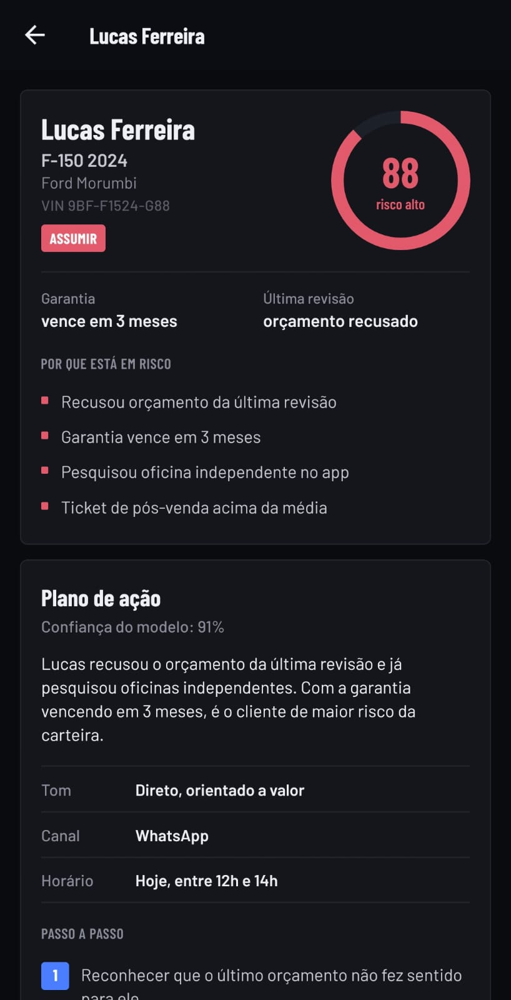
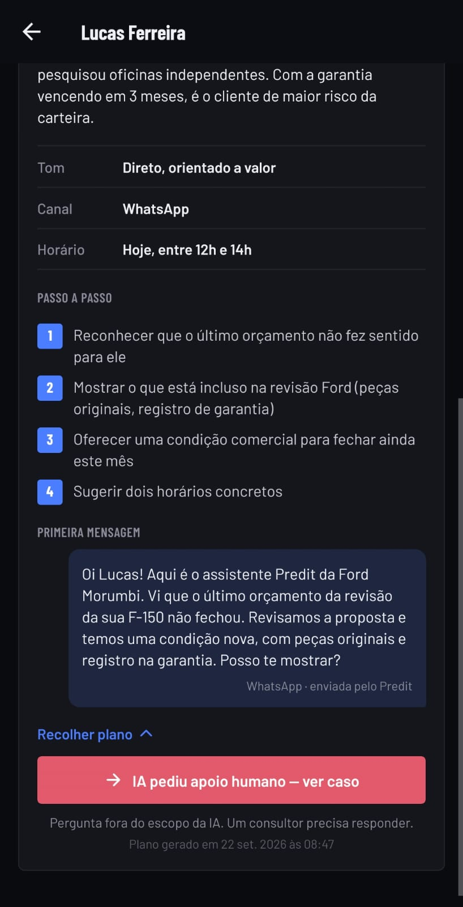
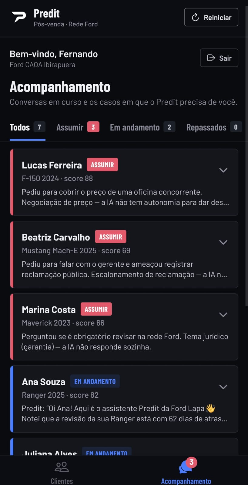
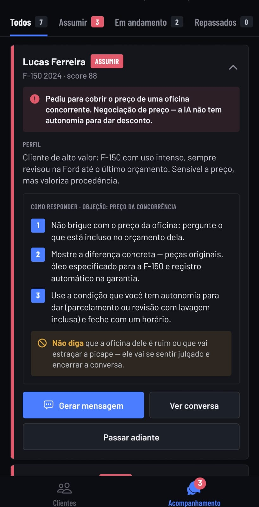
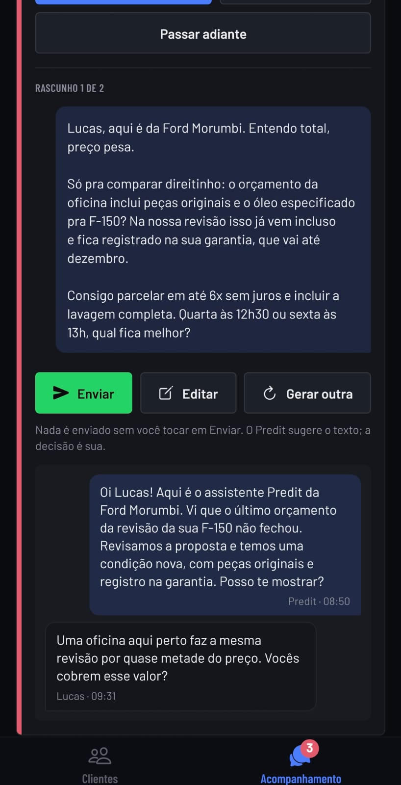

# Predit — Retenção preditiva por VIN (Mobile)

> Projeto acadêmico desenvolvido para a **FIAP** em parceria com a **Ford** — **entrega da Sprint 3**.

O **Predit** é um app mobile (Expo / React Native) que simula um produto de **retenção preditiva de clientes por VIN** para a rede de concessionárias Ford. Ele identifica clientes com risco de deixar a rede oficial de pós-venda e permite que o consultor **acione e acompanhe planos de ação conduzidos por um agente de IA**.

Esta versão mobile é uma **adaptação simplificada** do dashboard web do Predit, focada no fluxo principal: *ver quem está em risco → iniciar o plano de ação → acompanhar e responder as conversas da IA*.

---

## Integrantes

| Nome | RM |
|---|---|
| Fernando Navajas Moraes | RM555080 |
| José Guilherme Sipaúba Costa | RM557274 |
| Bruna da Costa Candeias | RM558938 |
| Weslley Cardoso | RM557927 |
| Gabriel Terra Lilla dos Santos | RM554575 |

---

## O problema

Depois que o carro sai da garantia (ou até antes), parte dos clientes deixa de fazer revisões na rede oficial Ford e passa a usar oficinas independentes. Isso reduz o **VIN Share** (a parcela da frota que continua sendo atendida pela concessionária) e a receita de pós-venda.

## A proposta

1. Um motor de IA calcula um **Score de risco de evasão (0–100%)** por cliente, com base em histórico de revisão, garantia e engajamento.
2. Para cada cliente, a IA gera um **Plano de Ação**: tom de abordagem, canal, melhor horário, passos recomendados e a primeira mensagem.
3. O consultor toca em **"Iniciar Plano de Ação"** e o agente de IA começa a conversa com o cliente.
4. Na tela de **Acompanhamento**, o consultor vê todas as conversas. Quando o cliente faz uma pergunta fora do escopo da IA (ex.: dúvida jurídica sobre garantia), o caso aparece como **"ASSUMIR"**, com perfil do cliente, motivo, roteiro de resposta e um aviso do que **nunca dizer**.
5. O consultor pode **gerar uma mensagem**, **editar**, **gerar outra opção** e **enviar**. A mensagem nunca sai sem um clique humano em "Enviar".

> **MVP / dados simulados:** não há IA real, backend nem integração com WhatsApp. Os 14 clientes (de 3 concessionárias e 9 modelos Ford), os planos e as conversas são dados mockados, e o envio de mensagens é um **simulacro** (a mensagem é registrada no histórico como enviada pelo agente de IA).

---

## Telas do app

### 1. Login e cadastro

<table>
  <tr>
    <td align="center"></td>
    <td align="center"></td>
  </tr>
  <tr>
    <td align="center"><b>Login</b></td>
    <td align="center"><b>Cadastro</b></td>
  </tr>
</table>

- **Login:** depois da abertura animada, o consultor entra com o e-mail corporativo (precisa terminar em `@ford.com`) e a senha. O olho mostra/oculta a senha e a opção **"Lembrar e-mail e senha neste aparelho"** faz o login vir preenchido na próxima abertura.
- **Cadastro:** nome completo, e-mail `@ford.com`, senha (mínimo 6 caracteres) e concessionária, escolhida numa lista de concessionárias Ford da Grande São Paulo. Ao criar a conta, o app volta para o login com o e-mail já preenchido.

### 2. Clientes em risco

<table>
  <tr>
    <td align="center"></td>
    <td align="center"></td>
  </tr>
  <tr>
    <td align="center"><b>Topo da fila de prioridade</b></td>
    <td align="center"><b>Restante da lista</b></td>
  </tr>
</table>

Tela inicial após o login. No topo ficam a saudação **"Bem-vindo, {nome}"** com a concessionária do consultor, e os botões **Reiniciar** (volta a demonstração ao início e apaga as contas) e **Sair**. Abaixo, a busca e a **fila de prioridade**: os clientes ordenados do maior para o menor score de risco. Cada card tem uma faixa lateral na cor do risco (vermelho = alto, amarelo = médio, verde = baixo), o carro, a concessionária, a próxima ação recomendada e a etiqueta do status da abordagem (**Assumir**, **Em andamento**, **Concluído**). O número na aba **Acompanhamento** indica quantos casos precisam de um consultor.

### 3. Detalhe do cliente e plano de ação

<table>
  <tr>
    <td align="center"></td>
    <td align="center"></td>
  </tr>
  <tr>
    <td align="center"><b>Resumo do cliente</b></td>
    <td align="center"><b>Plano de ação da IA</b></td>
  </tr>
</table>

- **Resumo do cliente:** carro, concessionária, VIN, medidor do score, situação da garantia, última revisão e os motivos que explicam o risco de evasão.
- **Plano de ação:** o que a IA recomenda para abordar o cliente: resumo da situação, tom, canal, melhor horário, passo a passo e a primeira mensagem que o agente envia. O botão principal muda conforme o estado: **Iniciar Plano de Ação** para quem ainda não foi abordado, ou atalhos para o acompanhamento (no exemplo, a IA já pediu apoio humano).

### 4. Acompanhamento das abordagens

<table>
  <tr>
    <td align="center"></td>
    <td align="center"></td>
    <td align="center"></td>
  </tr>
  <tr>
    <td align="center"><b>Lista de conversas</b></td>
    <td align="center"><b>Caso "Assumir"</b></td>
    <td align="center"><b>Rascunho e conversa</b></td>
  </tr>
</table>

- **Lista de conversas:** todas as abordagens que a IA está conduzindo, com filtros por status e contagem. Os casos que precisam de um consultor (**Assumir**) aparecem primeiro. Cada card mostra uma prévia e abre com um toque.
- **Caso "Assumir":** quando o cliente faz algo fora do escopo da IA (no exemplo, pedir para cobrir o preço de uma oficina concorrente), o card mostra o motivo, o perfil do cliente, um roteiro de **como responder** e o que **não dizer**.
- **Rascunho e conversa:** **Gerar mensagem** cria uma resposta pronta, que o consultor pode **editar** ou trocar por outra opção (**Gerar outra**). Nada sai sem tocar em **Enviar**. Abaixo aparece a conversa com o cliente em formato de chat: o cliente à esquerda, o Predit à direita.

---

## Funcionalidades

**Login e cadastro**
- Abertura animada com a marca Predit, seguida da tela de login
- Login com e-mail corporativo completo (precisa terminar em `@ford.com`) e senha
- Opção **"Lembrar e-mail e senha"**: na próxima abertura o login já vem preenchido, é só tocar em Entrar
- Cadastro com nome, e-mail `@ford.com`, senha (mín. 6 caracteres) e concessionária, escolhida numa lista de concessionárias Ford da Grande São Paulo. Depois do cadastro a pessoa volta ao login com o e-mail preenchido
- Saudação **"Bem-vindo, {nome}"** com a concessionária nas telas iniciais, e botão **Sair**

**Aba Clientes**
- Fila de prioridade ordenada por score, com faixa de cor por nível de risco (Alto ≥ 75 · Médio ≥ 55 · Baixo < 55)
- Busca por nome, VIN, modelo ou concessionária
- Status da abordagem em cada cliente (Assumir, Em andamento, Concluído, Repassado)

**Tela do cliente**
- Medidor de score, garantia, última revisão e motivos do risco
- **Plano de ação** gerado pela IA: resumo, tom, canal, horário, passo a passo e primeira mensagem
- Botão principal que muda conforme o estado do plano (Iniciar / Em andamento / Pedir apoio / Concluído / Repassado)

**Aba Acompanhamento**
- Filtros por status com contagem (Todos, Assumir, Em andamento, Repassados, Concluídos)
- Cards recolhidos com prévia; toque para expandir
- Gerar mensagem, editar, gerar outra opção e enviar (simulado), para todos os clientes
- Conversa com o cliente em formato de chat
- Passar o caso adiante e **retomar** depois
- Badge vermelho na aba quando algum caso precisa de apoio humano

**Geral**
- Estado salvo no aparelho (AsyncStorage): o progresso continua ao fechar e abrir o app
- Botão **Reiniciar** no cabeçalho: volta ao cenário inicial da demonstração e apaga todas as contas cadastradas e o login salvo

> **Sobre o login:** é local, sem servidor (MVP). As senhas das contas são guardadas apenas como hash SHA-256 com salt, e o "lembrar senha" usa o armazenamento seguro do aparelho (`expo-secure-store`).

---

## Tecnologias

| Camada | Tecnologia |
|---|---|
| Framework | [Expo](https://expo.dev) SDK 57 + React Native 0.86 |
| Navegação | Expo Router (abas + pilha) |
| Estado | React Context + `useReducer` |
| Persistência | `@react-native-async-storage/async-storage` |
| Login | `expo-secure-store` (credenciais lembradas) + `expo-crypto` (hash de senha) |
| Gráfico do score | `react-native-svg` |
| Fonte | Barlow e Barlow Condensed (`@expo-google-fonts/barlow`) |
| Ícones | `@expo/vector-icons` (Ionicons) |

---

## Como rodar

**Pré-requisitos:** Node.js 20+ e o app **Expo Go** instalado no celular (Android ou iOS).

```bash
# 1. Instalar as dependências
npm install

# 2. Iniciar o servidor de desenvolvimento
npx expo start
```

3. Escaneie o QR Code exibido no terminal com o Expo Go (Android) ou com a câmera (iOS).

> Celular e computador precisam estar na mesma rede Wi-Fi. Se não conectar, tente `npx expo start --tunnel`.

### Roteiro sugerido de demonstração

1. Na tela de login, toque em **Criar conta** → preencha nome, e-mail, senha e concessionária.
2. **Clientes** → abra **Rafael Lima** → toque em **Iniciar Plano de Ação**.
3. **Acompanhamento** → abra **Marina Costa** (ASSUMIR) → leia o roteiro → **Gerar mensagem** → **Gerar outra** → **Editar** → **Enviar**.
4. Veja o caso da Marina passar para "Em andamento" e o badge vermelho sumir.
5. Em qualquer caso, teste **Passar adiante** e depois **Retomar caso**.
6. Toque em **Sair**, marque **Lembrar e-mail e senha** ao entrar de novo, e reabra o app para ver o login preenchido.
7. Toque em **Reiniciar** no cabeçalho para apagar tudo e voltar ao início.

---

## Estrutura do projeto

```
PreditDashboard/
├── app/                          # Rotas (Expo Router — cada arquivo é uma tela)
│   ├── _layout.js                # Layout raiz: fontes, abertura, tema, estados globais, rotas protegidas por login
│   ├── login.js                  # Tela de login
│   ├── cadastro.js               # Tela de cadastro
│   ├── (tabs)/
│   │   ├── _layout.js            # Barra de abas: Clientes e Acompanhamento
│   │   ├── index.js              # Aba Clientes (fila de prioridade)
│   │   └── acompanhamento.js     # Aba Acompanhamento
│   └── cliente/[vin].js          # Detalhe do cliente + plano de ação
├── src/
│   ├── components/
│   │   ├── ui/                   # Genéricos: Button, Badge, Panel, Screen, TextField, ConfirmDialog, Toast, AppHeader, AnimatedSplash
│   │   ├── auth/                 # Login/cadastro: AuthScreen, DealerPicker
│   │   ├── clients/              # Lista e detalhe do cliente: CustomerRow, ScoreRing, AiPlanCard
│   │   └── tracking/             # Acompanhamento: TrackCard, ChatHistory
│   ├── constants/
│   │   ├── theme.js              # Cores, fontes e tokens de design
│   │   ├── status.js             # Rótulos, cores e ordem dos status da abordagem
│   │   └── dealers.js            # Concessionárias Ford disponíveis no cadastro
│   ├── context/
│   │   ├── AuthContext.js        # Contas, login, "lembrar senha" e sessão
│   │   └── PreditContext.js      # Clientes, abordagens, ações e persistência (AsyncStorage)
│   ├── hooks/useResetExperience.js # "Reiniciar": apaga clientes, contas e login salvo
│   ├── data/                     # Dados mockados: clientes e rascunhos de mensagem
│   └── utils/                    # Regras de risco e formatação de hora
├── assets/images/                # Logo, ícone do app e splash
├── docs/screenshots/             # Capturas de tela usadas neste README
├── app.json                      # Configuração do Expo (nome, ícone, splash, pacote Android)
└── jsconfig.json                 # Alias de importação @/ → src/
```

Os imports usam o alias `@/` para a pasta `src/` (ex.: `import Button from '@/components/ui/Button'`), em vez de caminhos relativos como `../../src/components/...`.

---

<sub>Projeto acadêmico — FIAP × Ford · Sprint 3. Os nomes, telefones e dados de clientes são fictícios.</sub>
